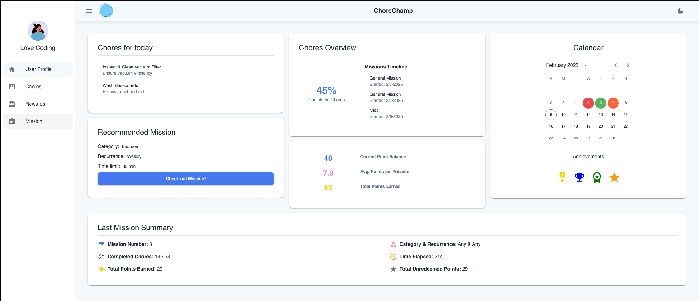
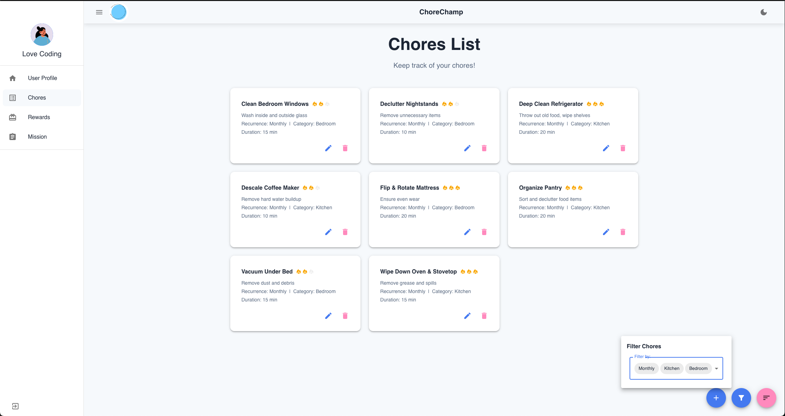
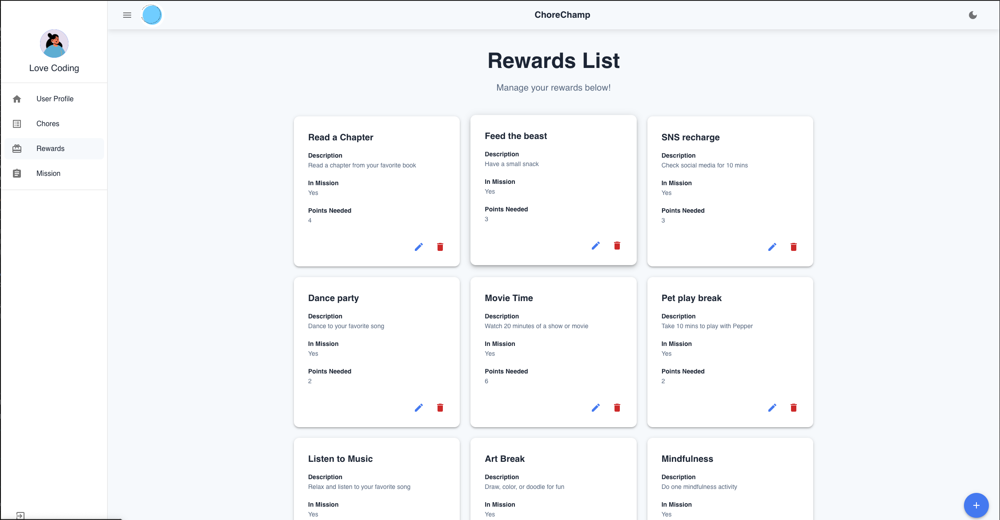
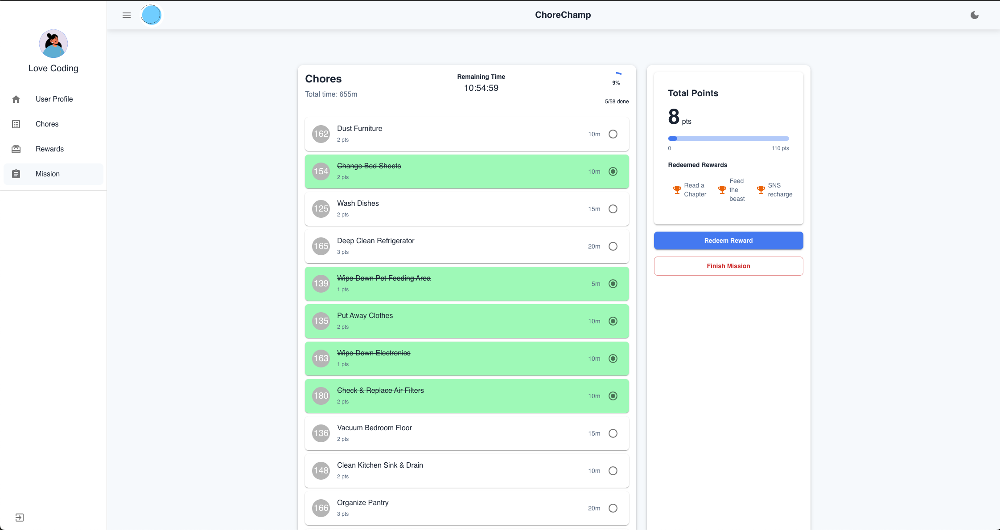

# ChoreChamp: A Gamified Chore Management App
[](https://reactrouter.com/)
[](https://www.typescriptlang.org/)
[](https://axios-http.com/)
[](https://mui.com/)
[](https://vitejs.dev/)
[](https://eslint.org/)
[](https://prettier.io/)
[](https://rainbow.me/)


ChoreChamp is a React-based web application that gamifies household chores, making task management fun and rewarding.
The app allows users to create and manage chores, embark on missions, earn points, and redeem rewards.
With its intuitive interface and engaging features, ChoreChamp transforms mundane household tasks into exciting challenges.
The app consists of two separate repositories: one for the Front-End and another for the Back-End API. In order to run this 
front-end application, the back-end api must be installed and running. Follow this [link](https://github.com/Msambere/chore-app-backend) and complete the back-end setup 
before continuing. 


## Demo
```
link: <>
```
## 🌟 Preview






## Repository Structure

```
chore-app-frontend/
└── src/
    ├── App.tsx
    ├── main.tsx
    ├── Components/
    │   ├── ChoresPage/
    │   ├── Layout/
    │   ├── LoginPage/
    │   ├── MissionPage/
    │   ├── RewardsPage/
    │   ├── SharedComponents/
    │   ├── SideBar/
    │   └── UserProfilePage/
    ├── HelperFunctions/
    ├── Theme/
    └── types/
```

Key Files:
- `App.tsx`: Main application component
- `main.tsx`: Entry point of the application
- `Components`: Is the backbone of our React front end. It houses reusable, modular UI building blocks that represent different parts of our application

Important integration points:
- `HelperFunctions/ApiCalls.ts`: Contains functions for making API calls to the backend
- `Theme/theme.ts`: Defines the application's theme
- `types/`: Contains TypeScript type definitions for the application

### Installation

Prerequisites:
- Node.js (^20)
- npm (10.9.2)

Steps:
1. Clone the repository 
```
https://github.com/Msambere/chore-app-frontend.git
```
2. Navigate to the project directory 
```
cd chore-app-frontend
```
3. Run `npm install` to install dependencies

### Configuration

The application uses environment variables for configuration.
Create a `.env` file in the root directory with the following variables:

```
VITE_APP_BACKEND_URL=<your_local_api_url>

```

### Getting Started
1. Make sure backend api is installed and running.

2. Start the development server:
   ```
   npm run dev
   ```
3. Open your browser and navigate to `http://localhost:<port number, default is 5173>`


### Common Use Cases

1. User Registration:
   - Navigate to the signup page
   - Fill in the required information
   - Submit the form to create a new account

2. Creating a Chore:
   - Log in to your account
   - Navigate to the Chores page
   - Click on "Create Chore"
   - Fill in the chore details and submit

3. Starting a Mission:
   - Click "Check out Mission" in User Profile for instance Start Mission
   - Navigate to the Mission page
   - Select mission parameters (recurrence, category, time limit)
   - Click "Start Mission" to begin

4. Redeeming Rewards:
   - Complete chores to earn points
   - Click Redeem Rewards in Mission Page
   - Select a reward to redeem with your earned points


## Data Flow

The ChoreChamp application follows a client-server architecture with the React frontend communicating with a backend API. 
Here's an overview of the data flow:

1. User Authentication:
   - User submits login credentials
   - Frontend sends a request to the backend API
   - Backend validates credentials and returns user data
   - Frontend stores user data in state and local storage

2. Chore Management:
   - User creates/edits/deletes a chore
   - Frontend sends API request with chore data
   - Backend processes the request and updates the database
   - Frontend updates local state with the response

3. Mission Flow:
   - User starts a mission
   - Frontend requests mission creation from the backend
   - Backend generates mission chores and returns data
   - Frontend displays active mission and tracks progress
   - As user completes chores, frontend sends updates to backend
   - Backend calculates points and updates mission status

4. Reward Redemption:
   - User selects a reward to redeem
   - Frontend sends redemption request to backend
   - Backend verifies points and processes redemption
   - Frontend updates user's point balance and reward status

```
+-------------+        +-------------+        +-------------+
|             |        |             |        |             |
|   Frontend  | <----> |  Backend API| <----> |  Database   |
|   (React)   |        |             |        |             |
|             |        |             |        |             |
+-------------+        +-------------+        +-------------+
      ^                      
      |                      
      v                      
+-------------+        
|             |        
|Local Storage|        
|             |        
+-------------+      
```

Note: Application ensures proper error handling and state management throughout the application to maintain data consistency between the frontend and backend.

## 🚀 Contact Us
### Amber Edwards - Fullstack SWE
[](https://www.linkedin.com/in/amber-edwards-swe/)
[](https://github.com/Msambere)
[](mailto:a.r.a.edwards@gmail.com)

### Anh Tran - Fullstack SWE
[](https://www.linkedin.com/in/anhtran077/)
[](https://github.com/momofAnAl)
[](mailto:anhtr077@gmail.com)

### Salma Anany - Fullstack SWE
[](https://www.linkedin.com/in/salma-anany/)
[](https://github.com/SalmaAnany)
[](mailto:salmayousry5@gmail.com)


